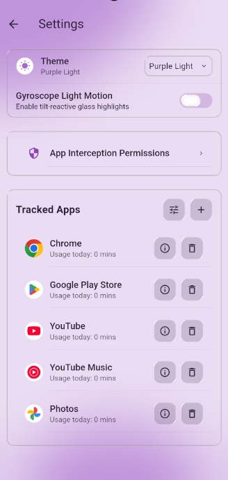

# <p align="center"></p>

<h1 align="center">Must Stay Focused</h1>

<p align="center">
  Anti Procrastination and focused productivity app to block distractions and maintain concentration.
</p>


<p align="center">
  <a href="https://github.com/ulab-design-project/must-stay-focused/releases/tag/Release">
    
  </a>
</p>


---

## ✨ Features

- distraction blocking
- focus session timer
- productivity tracking
- minimal clean interface
- cross platform support

---

## 📸 Screenshots


<br> <br>

<br> <br>

---

## 🛠️ Development Setup

### Prerequisites
- Flutter SDK
- OpenJDK 17 **(required for Android builds)**

### Java/Gradle Configuration
Do **NOT** commit machine-specific paths in `android/gradle.properties`. Configure this on your local developer machine only:

1.  Create/edit your user gradle properties file:
    - Linux/macOS: `~/.gradle/gradle.properties`
    - Windows: `%USERPROFILE%\.gradle\gradle.properties`

2.  Add this line with your local JDK 17 path:
    ```properties
    org.gradle.java.home=<your-local-jdk-17-path>
    ```

    Example Linux path:
    ```properties
    org.gradle.java.home=/usr/lib/jvm/java-17-openjdk
    ```

### Running the App

```bash
# Create test emulator
flutter emulators --create test_device

# Launch emulator
flutter emulators --launch test_device

# Verify connected devices
flutter devices

# Run on emulator (use correct device id from previous command)
flutter run -d emulator-5554
```

Build release APK:

```bash
flutter build apk --release --dart-define-from-file=.env
```
---

## 📝 License

This project is open source. 
GPL 3 License
